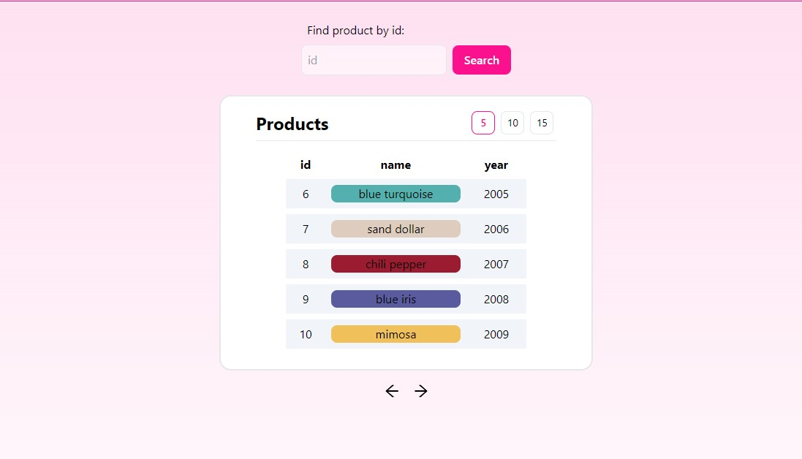

# react-pagination-app

Application is deployed on:\
https://react-pagination-app.vercel.app/



## Getting started
To try this application in your local environment:
1. Clone this repository:
```
git clone https://github.com/BlackH3art/react-pagination-app.git
```

2. Install dependencies:
```
npm install
```

3. Start application:
```
npm start
```

## Project requirements
- :white_check_mark: use https://reqres.in/api/products API endpoint
- input:
  - :white_check_mark: should be type text
  - :white_check_mark: should accept and display only numbers 
  - :white_check_mark: filtering by product id
- :white_check_mark: table should display id, name, year
- :white_check_mark: background color should be taken drom product data
- :white_check_mark: clicking table row should open modal with all product data
- :white_check_mark: table should display 5 items by default
- :white_check_mark: under the table should be pagination component with "next", "previous" arrows
- handling errors:
  - :white_check_mark: 4xx bad requests
  - :white_check_mark: 5xx server errors
### Nice to have:
- routing:
  - :white_check_mark: users can share links to certain page
  - :white_check_mark: users can share links to certain product
- :white_check_mark: context API
- :x: unit tests (time reasons)
### Additions:
- :white_check_mark: setting items per page
- :white_check_mark: displaying loading state
- :white_check_mark: closing modal on outside click
